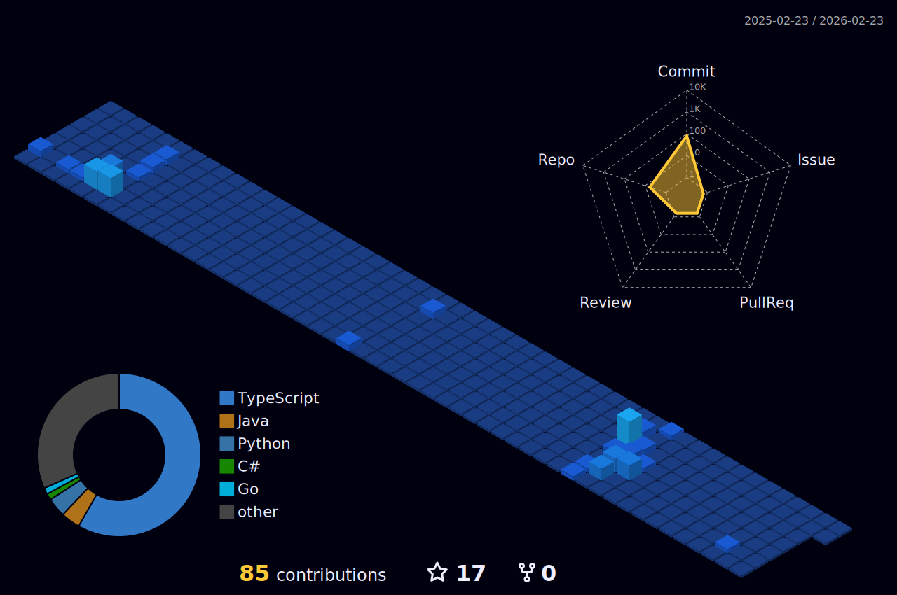

<!-- Header Section -->
<h2 align="left" style="font-size: 2em; margin-bottom: 0;">
  Welcome to my profile
  
   
  
I’m <i>Igor Almeida Guedes</i>

</h2>

- 🔭 Sistemas de Informacao UFJF
- 📫 How to reach me: guedes.igor018@gmail.com

  <h2>🔖 Meus Repositórios</h2>

  

    <a href="https://github.com/stars/IgorAlmeidaGuedes/lists/games-prototypes" style="text-decoration: none">🎮 Games & Prototypes</a>
  

  
  

    <a href="https://github.com/stars/IgorAlmeidaGuedes/lists/academic-works" style="text-decoration: none">🎓 Academic Works</a>
  

  
  

    <a href="https://github.com/stars/IgorAlmeidaGuedes/lists/basic-web-projects" style="text-decoration: none">🌐 Basic Web Projects</a>
  

### Skills:

 
  
  
  
  
  
   

### learning:
  

 
  
  
  

##

 
  
  
   

<!-- Stats Section -->

  <h3 style="margin-bottom: 0; font-weight: 400;">Meus Dashboards GitHub</h3>

  
  
  
 
      
    
  

  

