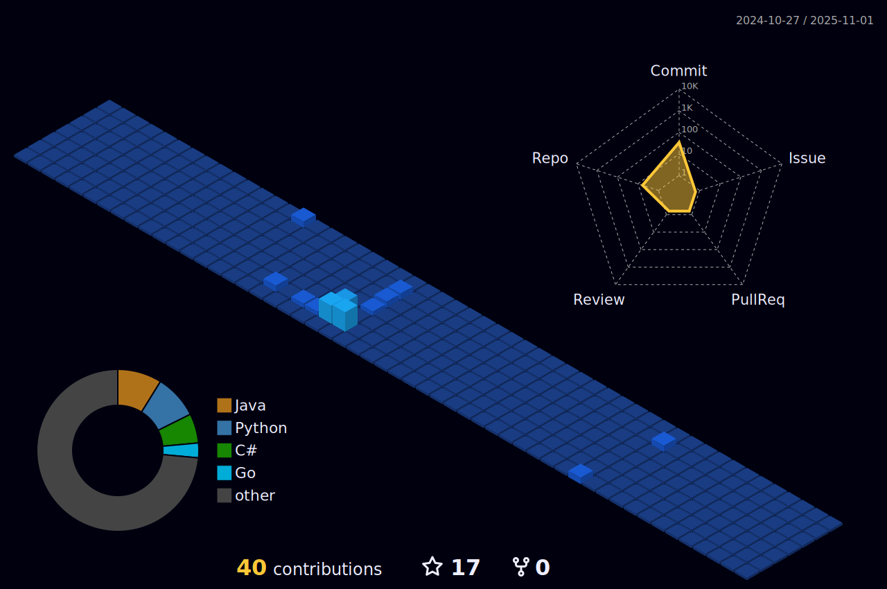

<!-- Header Section -->
<h2 align="left" style="font-size: 2em; margin-bottom: 0;">
  Welcome to my profile
  
   
  
I’m <i>Igor Almeida Guedes</i>

</h2>

<!-- Sections with Icons and Descriptions -->

  
  
<b>Software enginieer</b> - <i>Levty</i>

  

    (<b>Engenheiro de sofwware</b> - <i>Levty</i>)
  

  
  
<b>Information Systems</b> - <i>Universidade Federal de Juiz de Fora</i>

  

    (<b>Sistemas de Informação</b> - <i>Universidade Federal de Juiz de Fora</i>)
  

 

  
  

    Contact-me: <a href="mailto:guedes.igor018@gmail.com"><b>guedes.igor018@gmail.com</b></a>
  

  

    (Entre em contato comigo: <a href="mailto:guedes.igor018@gmail.com"><b>guedes.igor018@gmail.com</b></a>)
  

<!-- repositories Section -->

  <h3 style="font-weight: 400;">📓 My repositories</h3>
  
  

    <a href="https://github.com/stars/IgorAlmeidaGuedes/lists/games-prototypes" style="text-decoration: none">🎮 Games & Prototypes</a>
  

  
  

    <a href="https://github.com/stars/IgorAlmeidaGuedes/lists/academic-works" style="text-decoration: none">🎓 Academic Works</a>
  

  
  

    <a href="https://github.com/stars/IgorAlmeidaGuedes/lists/basic-web-projects" style="text-decoration: none">🌐 Basic Web Projects</a>
  

<!-- Skills Section -->

  <h2 style="font-weight: 400;">🖥️ Skills</h2>

  <h3>Advanced</h3>
  

    
    
    
    
    
    
  

  
  <h3>Intermediate</h3>
  

    
    
  

  
  <h3>Currently Learning</h3>
  

    
  

<!-- Social Section -->

  <h3>Contact me</h3>
  
  
  
  

<!-- Stats Section -->

  <h3 style="margin-bottom: 0; font-weight: 400;">My GitHub Dashboards</h3>

  

      
    
  

  

